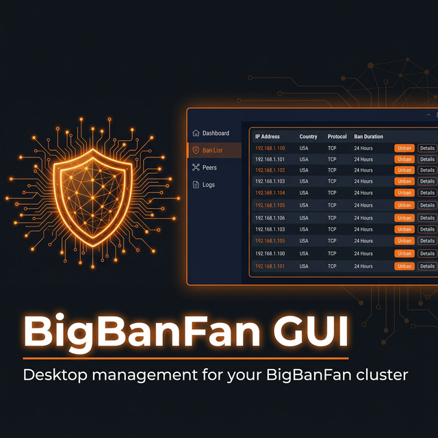

<div align="center">



**Stop chasing bans across servers. Manage your entire cluster from one place.**

The official desktop client for [BigBanFan](https://github.com/BurnRoberts/BigBanFan), the distributed IP ban system that propagates bans to every node the moment you act.

[](LICENSE)
[](https://wails.io)
[](https://golang.org)
[](https://svelte.dev)

</div>

---

## What It Does

Your BigBanFan cluster protects every server simultaneously. This GUI gives you a live window into that entire operation without touching a terminal or SSH session.

Connect to any node in your cluster and you get:

- **Dashboard** with active ban count, session stats, peer health, and a live rolling ban rate chart
- **Ban list** with search, filtering, pagination, ban by IP with optional reason, and individual or bulk unban
- **Peer topology view** showing how your nodes are connected, their status, and one-click switching to manage any peer directly
- **Live log stream** with level filtering (info / warn / error), pause and resume, badge notification when new lines arrive while you are on another view, and full history back-filled on connect
- **Saved connection profiles** so reconnecting to any node in your cluster is instant

Everything runs locally on your machine. No cloud. No middleman. No subscription.

---

## How It Works

BigBanFan nodes expose a management port (default **7779**) over TLS 1.3. The GUI connects directly, authenticates using your shared `client_key`, and holds a persistent connection that handles both request/response and live push events from the node.

```
┌─────────────────────┐                    ┌──────────────────────────┐
│     BigBanFan GUI   │                    │   BigBanFan Node :7779   │
│                     │ ──── TLS 1.3 ────► │                          │
│  queries, commands  │                    │  ban / unban the cluster │
│  ban, unban, search │ ◄─── push ──────── │  propagates to all peers │
│  logs, peers, stats │                    │                          │
└─────────────────────┘                    └──────────────────────────┘
                          real-time events:
                          ban events · peer up/down · live log lines
```

No polling. Events arrive the moment they happen on any node in the cluster.

---

## Getting Started

### Download a Release (Recommended)

Prebuilt binaries for Linux, macOS, and Windows are available on the
[Releases page](https://github.com/BurnRoberts/BigBanFan-Gui/releases).

Download the binary for your platform, mark it executable on Linux/macOS, and run it. No dependencies to install.

```bash
# Linux example
chmod +x bigbanfan-gui-linux-amd64
./bigbanfan-gui-linux-amd64
```

### Build from Source

If you prefer to build yourself or are working on the code:

#### Requirements

| Tool | Minimum Version |
|------|----------------|
| Go | 1.22 |
| Node.js | 18 |
| Wails CLI | v2.11 |
| WebKit2GTK (Linux only) | 4.1 |

Install the Wails CLI:

```bash
go install github.com/wailsapp/wails/v2/cmd/wails@latest
```

On Ubuntu/Debian, install the WebKit2GTK dependency:

```bash
apt install libwebkit2gtk-4.1-dev
```

### Build

```bash
git clone https://github.com/BurnRoberts/BigBanFan-Gui.git
cd BigBanFan-Gui

# Install frontend dependencies
npm install --prefix frontend

# Build native binary (output: build/bin/)
wails build
```

### Live Development

```bash
wails dev
```

Hot reload for the Svelte frontend. Go backend changes rebuild automatically.

---

## Connecting to a Node

You need three things from your BigBanFan node's `config.yaml`:

| Field | Config key | Example |
|-------|-----------|---------|
| Host | IP or hostname of the node | `192.168.1.10` |
| Port | `mgmt_port` | `7779` |
| Client Key | `client_key` | `a3f8...` (64 hex chars) |

Connection profiles are saved locally to `~/.config/bigbanfan-gui/profiles.json`. Your client key is stored in your OS config directory and is never transmitted in plaintext.

> The management port must be enabled on the node. Set `mgmt_port: 7779` in the node's `config.yaml` and ensure `client_key` is set. See the [BigBanFan daemon README](https://github.com/BurnRoberts/BigBanFan) for setup details.

---

## Views

### Dashboard

Overview of the connected node at a glance: active ban count, bans and unbans this session, scan detections, peer connection count, uptime, and a live ban rate chart that updates in real time.

### Ban List

Full searchable, paginated list of all bans on the node. Filter by IP substring, originating node, or active-only. Ban a new IP directly from the UI with an optional reason. Unban any entry individually or select multiple for bulk removal.

### Peers

Visual topology of all nodes the connected node knows about, with connection direction (inbound/outbound), last-seen timestamp, and current connected/disconnected state. Click any connected peer to switch management to that node directly.

### Logs

Live log stream from the node with configurable severity filter. Log lines are colour-coded by level. Pause the stream to read without it scrolling. History from before you connected is back-filled automatically. A badge on the nav button tracks unread lines while you are in another view.

---

## Security Notes

- All traffic is encrypted with TLS 1.3
- Every frame is authenticated with AES-256-GCM + HMAC-SHA256 using your `client_key`
- Nodes use self-signed certificates. Frame-level HMAC provides authentication independent of the certificate chain
- Your client key is stored locally in your OS config directory and never leaves your machine unencrypted
- Restrict which IPs can reach `mgmt_port` using `mgmt_allow_ranges` in the node config

---

## Platform Support

| Platform | Status |
|----------|--------|
| Linux | Supported (WebKit2GTK 4.1) |
| macOS | Supported |
| Windows | Supported |

---

## Related

- [BigBanFan](https://github.com/BurnRoberts/BigBanFan) - The distributed ban daemon this GUI manages

---

## License

MIT. See [LICENSE](LICENSE)
